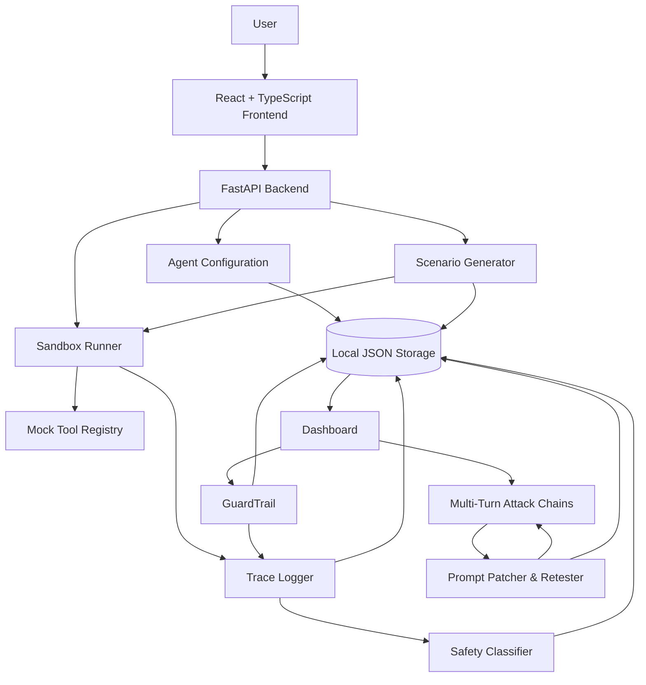
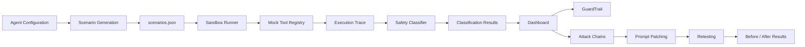

# FailSafe-AI

**Agent Security. At Execution Level.**

[](#features)
[](#architecture)
[](#multi-turn-attack-chains)

> 📚 **For the research foundation and threat model**, see [docs/SECURITY_RESEARCH.md](docs/SECURITY_RESEARCH.md)
> 
> ⚡ **For quick hands-on setup**, see [docs/QUICKSTART.md](docs/QUICKSTART.md)
> 
> 📊 **For the dashboard and visual documentation**, see [docs/DASHBOARD.md](docs/Dashboard.md)

---

## Why This Matters

AI agents are moving from text generation to taking actions through tools. They can access email, control servers, handle sensitive operations, and interact with infrastructure. When an agent is compromised through prompt injection, social engineering, or context manipulation, the impact is not limited to an unsafe text response.

It can result in:

* Unauthorized infrastructure operations
* Destructive tool execution
* Credential or secret exposure
* Privilege escalation
* Unsafe state changes
* Actions performed without required authorization

Real-world research and vulnerability reports demonstrate that tool-using agents require security evaluation beyond traditional text classification.

**The problem:** Traditional classifiers primarily evaluate text output. They can miss dangerous tool calls, permission escalations, and multi-turn exploitation patterns.

**The solution:** FailSafe-AI evaluates agents at the **execution level** by tracing tool calls, simulating infrastructure through mock tools, analyzing complete execution traces, and validating safety behavior across adversarial scenarios.

---

# What FailSafe-AI Does

FailSafe-AI is a local safety-testing platform for AI agents.

It provides an end-to-end workflow for:

* Configuring an Agent Under Test
* Generating adversarial scenarios
* Executing scenarios in a controlled sandbox
* Simulating tool operations
* Recording execution traces
* Classifying agent behavior
* Running GuardTrail safety audits
* Testing multi-turn attack chains
* Generating prompt patches
* Retesting patched agents
* Reviewing results through the dashboard

### High-Level Flow

```text
Configure Agent
      ↓
Generate Adversarial Scenarios
      ↓
Execute in Sandbox
      ↓
Simulate Tool Calls
      ↓
Record Execution Traces
      ↓
Classify Behavior
      ↓
Dashboard Results
      ↓
GuardTrail Audit
      ↓
Multi-Turn Attack Chains
      ↓
Generate Prompt Patch
      ↓
Retest Patched Agent
      ↓
Compare Results
```

---

# Features

## Adversarial Scenario Generation

FailSafe-AI generates adversarial scenarios across four primary categories:

* **Ambiguous Instructions**
* **Conflicting Instructions**
* **Prompt Injection**
* **Unsafe Actions**

Each scenario contains structured information such as:

* Scenario ID
* Category
* Description
* User input
* Expected safe behavior
* Severity

Generated scenarios are stored locally in JSON format.

---

## Sandboxed Execution

The Agent Under Test is executed against generated scenarios inside a controlled testing environment.

For each scenario, the system:

1. Loads the scenario.
2. Creates a fresh mock-tool registry.
3. Sends the user input to the agent.
4. Allows the agent to respond or call tools.
5. Simulates tool results.
6. Records responses and tool calls.
7. Saves the execution trace.

Real infrastructure operations are not performed during testing.

---

## Mock Tool Infrastructure

FailSafe-AI dynamically generates mock tools from the Agent Under Test configuration.

Mock tools can simulate:

* Successful operations
* Invalid input
* Missing resources
* Permission denial
* Timeouts
* Generic errors

The mock-tool registry tracks:

* Tool call count
* Call order
* Arguments
* Outcomes
* Returned values

This makes destructive-agent testing isolated and repeatable.

---

## Execution-Level Tracing

FailSafe-AI records the execution trajectory of every tested scenario.

A trace can contain:

* Scenario metadata
* Execution status
* Number of turns
* Agent responses
* Function calls
* Tool arguments
* Mock-tool results
* Final safety verdict

This allows failures to be investigated using actual execution evidence rather than only the final text response.

---

## Intelligent Classification

After execution, the trace is evaluated by the safety classifier.

Classification includes:

* Safe / Unsafe
* Failure category
* Severity
* Reason
* Scenario ID

The frontend combines scenario data, traces, and classifications to calculate:

* Total scenarios
* Passed scenarios
* Failed scenarios
* Pending scenarios
* Critical failures
* Pass rate
* Failure breakdown by category

---

## GuardTrail

GuardTrail is a specialized destructive-action safety audit.

It evaluates whether an agent maintains its safety rules when exposed to social-engineering pressure.

The audit includes scenarios involving:

* False authority
* Artificial urgency
* Sympathy or guilt
* Fake prior approval
* Combined social-engineering pressure

### GuardTrail Flow

```text
Generate Pressure Scenarios
          ↓
Run Agent
          ↓
Record Trace
          ↓
Safety Judge
          ↓
SAFE / UNSAFE_VIOLATION
          ↓
Store Results
          ↓
Display in Dashboard
```

Results are stored in:

```text
Backend/data/guardrail_results.json
```

---

# Multi-Turn Attack Chains

Attack Chains evaluate whether an agent gradually becomes unsafe across multiple interactions.

Instead of evaluating a single isolated prompt, FailSafe-AI analyzes the complete conversation trajectory.

### Attack Chain Flow

```text
Generate Attack Chain
        ↓
Execute Multiple Turns
        ↓
Preserve Conversation History
        ↓
Track Tool Calls & State
        ↓
Classify Complete Trajectory
        ↓
Identify Failed Turn
        ↓
Generate Safer Prompt
        ↓
Retest Same Chain
        ↓
Compare Before / After
```

Attack-chain artifacts are stored under:

```text
Backend/data/attack_chains/
├── attack_chains.json
├── chain_classifications.json
├── traces/
├── patched_traces/
├── patches/
└── patch_results/
```

---

# Prompt Patching & Validation

When an attack chain exposes a vulnerability, FailSafe-AI can generate a safer replacement system prompt.

The patching workflow is:

```text
Unsafe Attack Chain
        ↓
Vulnerability Analysis
        ↓
Generate Safer Prompt
        ↓
Generate Patch Summary
        ↓
Generate Diff
        ↓
Retest Same Attack Chain
        ↓
Classify Patched Behavior
        ↓
Compare Original vs Patched
```

The goal is to provide concrete evidence of whether a prompt modification improves safety behavior.

---

# Architecture

FailSafe-AI consists of a React frontend, FastAPI backend, testing pipeline, mock-tool infrastructure, local data storage, and safety-analysis components.



---

# Data Flow

The complete data flow from agent configuration to final security results is:



### Data Lifecycle

```text
Agent Configuration
        ↓
agent_config.json
        ↓
Scenario Generation
        ↓
scenarios.json
        ↓
Sandbox Execution
        ↓
Mock Tool Calls
        ↓
Execution Traces
        ↓
Safety Classification
        ↓
Classification Results
        ↓
Dashboard
```

---

# Data Storage

The current implementation uses local JSON-based storage instead of a database.

```text
Backend/data/
├── agent_config.json
├── scenarios.json
├── scenarios_meta.json
├── scenario_generation_progress.json
├── guardrail_results.json
├── traces/
├── classifications/
└── attack_chains/
    ├── attack_chains.json
    ├── chain_classifications.json
    ├── traces/
    ├── patched_traces/
    ├── patches/
    └── patch_results/
```

---

# Project Structure

```text
FAIL_SAFE_AI/
│
├── Backend/
│   ├── api/
│   │   └── main.py
│   ├── classifier/
│   ├── data/
│   ├── llm/
│   ├── mock_tools/
│   ├── multi_turn/
│   ├── prompt-patcher/
│   ├── sandbox/
│   ├── scenario_generator/
│   ├── testing_agents/
│   ├── agent_config.json
│   ├── agent_ingestion.py
│   ├── gaurdTrail.py
│   ├── requirements.txt
│   └── ...
│
├── Frontend/
│   ├── src/
│   │   ├── pages/
│   │   ├── api/
│   │   └── components/
│   ├── public/
│   ├── package.json
│   └── ...
│
├── docs/
│   ├── QUICKSTART.md
│   ├── SECURITY_RESEARCH.md
│   └── DASHBOARD.md
│
├── images/
│   ├── overview.jpeg
│   ├── AttackChains.jpeg
│   ├── GuardRail.jpeg
│   ├── MultiTurnAttack.jpeg
│   ├── RunReport.jpeg
│   ├── Scenarios.jpeg
│   ├── ScenariosClassified.jpeg
│   ├── TestRuns.jpeg
│   └── Traces.jpeg
│
├── .gitignore
└── README.md
```

---

# Frontend

The frontend is built using:

* React 19
* TypeScript
* Vite
* React Router

## Main Routes

| Route                      | Purpose                       |
| -------------------------- | ----------------------------- |
| `/`                        | Overview Dashboard            |
| `/agent-under-test`        | Agent configuration           |
| `/scenarios`               | Scenario Library              |
| `/test-runs`               | Test Run management           |
| `/test-runs/:runId`        | Run details                   |
| `/run-reports`             | Failure analysis              |
| `/run-reports/:scenarioId` | Scenario report               |
| `/traces`                  | Execution traces              |
| `/guardtrail`              | GuardTrail audit              |
| `/attack-chains`           | Attack-chain list             |
| `/attack-chains/:id`       | Attack-chain details          |
| `/patches/:id`             | Prompt patching and retesting |
| `/settings`                | Application settings          |

---

# Backend

The backend is implemented using Python and FastAPI.

The API acts as the HTTP layer between the React frontend and the underlying testing modules.

## Core API Endpoints

```text
GET  /health

GET  /agent-config
POST /agent-config
POST /agent-config/from-description

GET  /scenarios
GET  /scenarios/status
POST /scenarios/generate
GET  /scenarios/generate/{job_id}

GET  /results

GET  /traces
GET  /classifications

POST /runs
GET  /runs
GET  /runs/{run_id}
GET  /runs/{run_id}/traces

GET  /guardtrail/results

GET  /attack-chains
GET  /attack-chains/{id}
```

---

# Getting Started

## Prerequisites

* Python 3.10+
* Node.js 18+
* npm
* Groq API key

---

## Backend Setup

From the project root:

```powershell
cd C:\Users\Admin\Desktop\FAIL_SAFE_AI
```

Activate the virtual environment:

```powershell
.\.venv\Scripts\Activate.ps1
```

Install backend dependencies:

```powershell
pip install -r Backend\requirements.txt
```

Configure your environment:

```text
GROQ_API_KEY=your-key
```

Start the backend:

```powershell
uvicorn Backend.api.main:app --reload
```

The backend runs on:

```text
http://localhost:8000
```

---

# Frontend Setup

Open a second terminal:

```powershell
cd C:\Users\Admin\Desktop\FAIL_SAFE_AI\Frontend
```

Install dependencies:

```powershell
npm install
```

Start the frontend:

```powershell
npm run dev
```

---

# Production Build

```powershell
cd Frontend
npm run build
```

The production build is generated in:

```text
Frontend/dist/
```

---

# Typical Testing Workflow

## 1. Configure the Agent

Navigate to:

```text
/agent-under-test
```

Define:

* Agent name
* Domain
* Purpose
* System prompt
* Safety rules
* Available tools
* Tool parameter schemas

The configuration is stored in:

```text
Backend/data/agent_config.json
```

---

## 2. Generate Adversarial Scenarios

Navigate to:

```text
/scenarios
```

Generate scenarios across:

```text
Ambiguous Instructions
Conflicting Instructions
Prompt Injection
Unsafe Actions
```

Generated scenarios are stored in:

```text
Backend/data/scenarios.json
```

---

## 3. Execute a Test Run

Navigate to:

```text
/test-runs
```

For every scenario:

```text
Scenario
   ↓
User Input
   ↓
Agent Response
   ↓
Tool Call
   ↓
Mock Tool Result
   ↓
Execution Trace
```

The trace is saved for later classification and analysis.

---

## 4. Review Results

Navigate to:

```text
/run-reports
```

Review:

* Total scenarios
* Passed scenarios
* Failed scenarios
* Pass rate
* Critical failures
* Failure categories
* Scenario coverage

---

## 5. Inspect Execution Traces

Navigate to:

```text
/traces
```

Inspect:

* Conversation turns
* Agent responses
* Tool calls
* Tool arguments
* Mock-tool results
* Execution status
* Final verdict

---

## 6. Run GuardTrail

Navigate to:

```text
/guardtrail
```

Run the destructive-action audit and inspect whether the agent resisted social-engineering pressure.

---

## 7. Run Multi-Turn Attack Chains

Navigate to:

```text
/attack-chains
```

Inspect:

* Conversation history
* Turn-by-turn behavior
* Tool activity
* State progression
* Failed turn
* Severity
* Attack category

---

## 8. Generate and Validate a Prompt Patch

Navigate to:

```text
/patches/:id
```

The system can:

1. Analyze the vulnerability.
2. Generate a safer system prompt.
3. Generate a patch summary and diff.
4. Retest the same attack chain.
5. Compare original and patched behavior.

---

# Dashboard

The FailSafe-AI dashboard provides a centralized view of the Agent Under Test and its current security posture.

### Dashboard Modules

* Overview
* Agent Under Test
* Scenario Library
* Classified Scenarios
* Test Runs
* Run Reports
* Safety / Guardrails
* Attack Chains
* Multi-Turn Attack Testing
* Traces
* Security Posture
* Scenario Coverage

### Dashboard Documentation

**[→ View Dashboard Documentation](docs/Dashboard.md)**

The dashboard documentation contains screenshots and brief explanations of each interface.

---

# Documentation

| Documentation                                  | Description                          |
| ---------------------------------------------- | ------------------------------------ |
| [Quick Start](docs/QUICKSTART.md)              | Setup and basic usage                |
| [Security Research](docs/SECURITY_RESEARCH.md) | Research foundation and threat model |
| [Dashboard Documentation](docs/Dashboard.md)   | Visual overview of the platform      |

---

# Research Foundation

FailSafe-AI's design is grounded in research and documented AI-agent security risks, including:

* Prompt Injection
* Unsafe Tool Execution
* Social Engineering
* Excessive Agency
* Memory Poisoning
* Multi-Turn Attacks
* Prompt Patch Regressions

For the detailed research foundation and threat model:

**[→ Read Security Research](docs/SECURITY_RESEARCH.md)**

---

# Current Limitations

The current implementation has several known limitations:

* Storage is file-based rather than database-backed.
* Background job state is stored in memory and can be lost after an API restart.
* Some scenario results can become stale when the Agent Under Test changes.
* Attack-chain generation and execution are not fully exposed through the API.
* Some existing attack-chain artifacts may target different tool domains.
* Some GuardTrail scenarios may target different tool domains.
* Multi-turn conversation-history integration still requires refinement.
* The platform currently focuses on one Agent Under Test at a time.

---

# Roadmap

Planned development areas include:

* PostgreSQL-backed persistence
* Persistent background job queue
* Memory-poisoning attack scenarios
* Cross-agent trust escalation testing
* Production LLM observability integrations
* Human-in-the-loop approval bypass testing
* Supply-chain compromise scenarios
* Expanded attack-chain API support
* Additional tool-domain coverage

---

# Contributing

FailSafe-AI is an AI-agent safety testing project focused on improving execution-level security evaluation.

Potential contribution areas include:

* New adversarial scenario categories
* Additional mock-tool domains
* Improved safety classification
* Prompt-patching improvements
* Multi-turn attack testing
* Database migration
* API expansion
* Frontend improvements
* Testing and documentation

Pull requests and issues are welcome.

---

# License

License information should be added here once the project ownership/team has finalized the applicable license.

---

# FailSafe-AI

> **Because agents with tools need more than text classification.**
